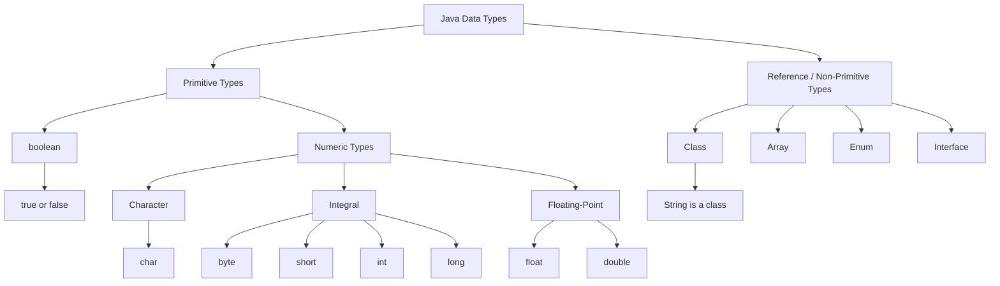

# oracle-certification-java-21

- **Package**  -> A package is an organized module of related interfaces and classes.
- **class** -> A class refers to set of related objects with common properties.
- **Object** -> combination of variables and methods (data structures) 
- **OOP(Object-Oriented-Programming)** ->Revoles with objects and data rather than action and logic. JAVA, PYTHON, KOTLIN uses OOP
- **Method/Function** -> Method is a block of code that can be referenced by name in order to run.
- **Parameter/Arguments** ->Arguments or args is a value that is passed into command or function

## What is Java?
- Java is a programming language released in 1995 by sun micro system which was later acquired by oracle coporation. Java is a platform independent language(WORM). which means write once and ready anywhere.

- When you compile java code it goes into an intermediate language called bytecode. the format of bytecode is independent. 

### Development Tools
  - JDK (Java Development Kit) ->  Includes everything required to build, test and optimize application. It includes 
    - Javac compiler ->  Which turns the code into runnable programms.  Converts Java source code (`.java`) into bytecode (`.class`).
    - Java launcher -> Even fasther with java21 feature
    - Jshell -> Interactive shell for quick testing
    - J package -> which bundles apps into native installers (for distributing) based on operating systems.

 - Java Application Programming Interface
    - Includes core utilities for data structures, file handling and multi threading
 - J package ->jpackage is a JDK tool used to turn a finished Java application into an installer.
 - User Interface toolkits -> For GUI, Swing etc.
 - Integration Libaries -> Dtabase connection etc.

 ### What is JDK, JRE, JVM
 - JDK -> used to develop java applications. include all the tools to develop and run java application.  Inside JDK it has JRE and inside JRE it has JVM and development tools too.
 - JRE ->bundles libaries and the java virtual machine and other components to run application
- JVM -> It runs java programs.

### How this process works?
- Java compiler compiles the code into byte code. 
```diff
javac HelloWorld.java -> compiles the code and generates bytecode: HelloWorld.class

To create bytecode
- javac HelloWorld
+ javac HelloWorld.java

To run compiled bytecode
- java HelloWorld.class
+ java HelloWorld

Java Launcher method (Java 11+)
- java HelloWorld
+ java HelloWorld.java
```
### Package Naming Rules

- By convention, package names start with a lowercase letter.

  ```java
  package com.example.app;
  ```

- A package name cannot contain spaces.
- Numbers can be used after the first letter.
- Capital letters are technically allowed
- Keywords are not allowed

  ```java
  package com.example.java21; // Valid
  ```

- Hyphens and symbols such as `@`, `#`, and `!` cannot be used. Cannot be used anywhere not at start or end

  ```java
  package com.example.my-app; // Invalid
  ```

- Dots (`.`) separate package names.

  ```java
  package com.company.project;
  ```

### Class Naming Rules

- By convention, a class name starts with a capital letter.

  ```java
  class Student { }
  ```

- A class name cannot contain spaces.

  ```diff
  - class Student Details { }
  ```

- Numbers are allowed after the first character.

  ```java
  class Student21 { }
  ```

- A class name cannot start with a number.

  ```diff
  - class 21Student { }
  ```

- Underscore (`_`) and dollar sign (`$`) are allowed as the first character or later characters or even in middle, but normally avoided.

  ```java
  class _Student { }   // Valid, but not recommended
  class $Student { }   // Valid, but not recommended
  class Student_21 { } // Valid, but not recommended
  ```

- Hyphens and symbols such as `@`, `#`, and `!` cannot be used anywhere.

  ```diff
  - class Student-Details { }
  - class Student@Details { }
  ```

- Java keywords cannot be used as class names.

  ```diff
  - class class { }
  ```

- Class names can contain capital letters. By convention, use **PascalCase**.

  ```java
  class StudentDetails { } // Recommended
  ```

### Java Main Method

A Java program starts from the `main` method.

```java
public class HelloWorld {

    public static void main(String[] args) {
        System.out.println("Hello World");
    }
}
```

#### What can change?


- The parameter name can change.

  ```java
  public static void main(String[] names) { }
  ```

- Array brackets can be written in different valid ways.

  ```java
  public static void main(String[] args) { }
  public static void main(String args[]) { }
  ```

- Varargs can be used instead of an array.

  ```java
  public static void main(String... args) { } // Valid
  ```

  ```diff
  - public static void main(String args...) { } // Invalid
  ```

- Modifier order can change, although `public static` is the normal style.

  ```java
  static public void main(String[] args) { }
  ```

#### What cannot change?

- The method name must be `main`.

  ```diff
  - public static void start(String[] args) { }
  ```

- It must be `public` and `static`.

  ```diff
  - static void main(String[] args) { }
  - public void main(String[] args) { }
  ```

- The return type must be `void`.

  ```diff
  - public static int main(String[] args) { }
  ```

- The parameter type must be `String[]` or `String...`.

  ```diff
  - public static void main(int[] args) { }
  - public static void main(String args) { }
  ```

### System.out.print methods
- System.out.print() -> Prints but doesnt keep a new line afterwards
- System.out.println() -> Prints and keep a new line afterwards
- System.out.printf() -> provides string formating 
    - System.out.printf("Hello %s" , "World");. ->  
        - %s → String / any object as text
        - %d → integer numbers (`int`, `long`, etc.)
        - %f → decimal numbers (`float`, `double`)
        - %b → boolean (`true` / `false`)
        - %n → new line

 

### Comments in Java

- A **single-line comment** starts with `//`.

  ```java
  // This is a single-line comment
  int age = 25;
  ```

- A **multi-line comment** starts with `/*` and ends with `*/`.

  ```java
  /*
   This is a multi-line comment.
   It can continue on many lines.
  */
  int age = 25;
  ```

- A **documentation comment** starts with `/**` and ends with `*/`.
  It is used to generate documentation using `javadoc`.

  ```java
  /**
   * Prints a welcome message.
   */
  public void welcome() {
      System.out.println("Welcome");
  }
  ```

### Scanner Class

Import the `Scanner` class:

```java
import java.util.Scanner;
```

Create a `Scanner` object to read keyboard input:

```java
Scanner input = new Scanner(System.in);
```

Read different input types:

```java
System.out.println("Enter a number:");
int number = input.nextInt();        // int

System.out.println("Enter a decimal number:");
double price = input.nextDouble();   // double

System.out.println("Enter a float value:");
float value = input.nextFloat();     // float

System.out.println("Enter a word:");
String word = input.next();          // one word

System.out.println("Enter a full sentence:");
String sentence = input.nextLine();  // full line

System.out.println("Enter a character:");
char letter = input.nextLine().charAt(0); // one character
```

Close the scanner when you no longer need it:

```java
input.close();
```

### Variables in Java

A variable stores a value in memory.

#### Declaration

Declaration means creating a variable with a data type and a name.

```java
int age;
```

#### Initialization

Initialization means giving a value to a variable.

```java
age = 25;
```

#### Declaration and Initialization Together

```java
int age = 25;
```

#### Multiple Variables in One Line

Variables declared in the same statement must have the same data type.

```java
int age1 = 20, age2 = 25, age3 = 30;
```

```diff
- int age = 20, String name = "Kavinda"; // Invalid
```

### Variable Naming Rules

- A variable name can start with a letter, underscore (`_`), or dollar sign (`$`).

  ```java
  int age;
  int _age;
  int $age;
  ```

- Numbers can be used after the first character.

  ```java
  int age21;
  ```

  ```diff
  - int 21age;
  ```

- Underscore (`_`) and dollar sign (`$`) can be used at the beginning, middle, or end.

  ```java
  int _age;
  int a_ge;
  int age_;

  int $age;
  int a$ge;
  int age$;
  ```

- Spaces, hyphens, and symbols such as `@`, `#`, and `!` cannot be used any where.

  ```diff
  - int student age;
  - int student-age;
  - int student@age;
  ```

- Java keywords cannot be used as variable names.

  ```diff
  - int class = 10;
  ```

- By convention, variable names use `camelCase`.

  ```java
  String studentName = "Kavinda";
  ```
### Types of Variables

#### 1. Instance Variable

An instance variable is declared inside a class but outside methods.

Each object gets its own separate copy.

```java
class Student {
    String name; // Instance variable
}
```

```java
Student s1 = new Student();
Student s2 = new Student();

s1.name = "Kavinda";
s2.name = "Nimal";
```

#### 2. Static Variable

A static variable belongs to the class, not to individual objects.

All objects share one same static variable. Static variable cannot be declared inside a method. it should be inside a class

```java
class Student {
    static String school = "ABC College"; // Static variable
}
```

```java
System.out.println(Student.school);
```

```diff
- void test() {
-     static int count = 0; // Invalid
- }
```


#### 3. Local Variable

A local variable is declared inside a method, constructor, or block.

It can be used only inside that area.

```java
class Student {
    void showAge() {
        int age = 25; // Local variable
        System.out.println(age);
    }
}
```

### Java Data Types



### Primitive Data Types

| Data Type | Size | Range / Description | Default Value |
|---|---:|---|---|
| `byte` | 1 byte (8 bits) | -128 to 127 | `0` |
| `short` | 2 bytes (16 bits) | -32,768 to 32,767 | `0` |
| `int` | 4 bytes (32 bits) | -2³¹ to 2³¹ - 1 | `0` |
| `long` | 8 bytes (64 bits) | -2⁶³ to 2⁶³ - 1 | `0L` |
| `float` | 4 bytes (32 bits) | Decimal number; add `f` or `F` at the end | `0.0f` |
| `double` | 8 bytes (64 bits) | Decimal number; default decimal type | `0.0d` |
| `char` | 2 bytes (16 bits) | Stores one Unicode character | `'\u0000'` |
| `boolean` | JVM-dependent | Stores only `true` or `false` | `false` |
| Reference types (`String`, arrays, classes, etc.) | — | Stores an object reference | `null` |


### Numeric Literals

#### `long` Literal

A whole number is treated as an `int` by default. If the number is too large for `int`, add `L` or `l` at the end to make it a `long`.

```diff
- long i = 1234561231311; // Compilation error: number is too large for int
```

```java
long i = 1234561231311L; // Valid
long j = 1234561231311l; // Valid, but uppercase L is recommended
```

#### Underscore (`_`) in Numbers

Underscores can make large numbers easier to read.

```java
int population = 1_000_000; // Valid
double price = 1_250.50_75; // Valid
```

Underscores cannot be at the beginning or end of a number.

```diff
- int number = _1000;  // Invalid
- int number = 1000_;  // Invalid
```

For decimal numbers, an underscore cannot be immediately before or after the decimal point or at the begining or end of the number.

```diff
- double price = 1250_.50; // Invalid
- double price = 1250._50; // Invalid
```
 ### Numbers in Java

 #### Decimal (Base 10)

Uses digits `0` to `9`. No prefix is needed.

```java
int num = 25;
```

```text
25 = (2 × 10¹) + (5 × 10⁰)
   = (2 × 10) + (5 × 1)
   = 20 + 5
   = 25
```

#### Binary (Base 2)

Uses only `0` and `1`. Use prefix `0b` or `0B`.

```java
int num = 0b1101;
```

```text
This is basically 0's and 1's
0b1101 = (1 × 2³) + (1 × 2²) + (0 × 2¹) + (1 × 2⁰)
        = (1 × 8) + (1 × 4) + (0 × 2) + (1 × 1)
        = 13
```
```diff
- int binary = 0b102; // Invalid: binary can use only 0 and 1
```
#### Octal (Base 8)

Uses digits `0` to `7`. Use prefix `0`.

```java
int num = 014;
```

```text
014 = (1 × 8¹) + (4 × 8⁰)
    = (1 × 8) + (4 × 1)
    = 12
```
```diff
- int octal = 018; // Invalid: octal can use only digits 0 to 7
- int octal = 019; // Invalid: octal can use only digits 0 to 7
```
#### Hexadecimal (Base 16)

Uses digits `0` to `9` and letters `A` to `F`. Use prefix `0x` or `0X`.

```java
int num = 0x1A;
```

```text
0x1A = (1 × 16¹) + (10 × 16⁰)
     = (1 × 16) + (10 × 1)
     = 26
```

```diff
- int hexadecimal = 0x1G; // Invalid: hexadecimal uses 0-9 and A-F only
```
### Converting Numbers to Binary, Octal, and Hexadecimal

The `Integer` class can convert an `int` value into a `String` representation.

```java
int number = 13;

System.out.println(Integer.toBinaryString(number)); // 1101
System.out.println(Integer.toOctalString(number));  // 15
System.out.println(Integer.toHexString(number));    // d
```

- `Integer.toBinaryString(13)` returns `"1101"`.
- `Integer.toOctalString(13)` returns `"15"`.
- `Integer.toHexString(13)` returns `"d"`.

These methods return a `String`, not an `int`.

They do not add prefixes:

```text
1101  // not 0b1101
15    // not 015
d     // not 0xD
```

### Type Conversion and Casting

Type conversion means changing a value from one data type to another.

#### 1. Automatic Type Conversion (Widening)

When converting from a smaller compatible type to a larger type, Java does it automatically.

```java
int number = 10;
double value = number; // int → double
```

```text
Small → Large = No cast needed
```

```text
byte → short → int → long → float → double
```

#### 2. Type Casting (Narrowing)

When converting from a larger type to a smaller type, Java gives a compilation error.

```diff
- int number = 25.7; // Compilation error: double → int
```

Use an explicit cast:

```java
double value = 25.7;
int number = (int) value; // double → int
```

```text
Large → Small = Cast needed
```

```text
double → float → long → int → short → byte
```

```text
25.7 becomes 25 because the decimal part is removed.
Casting from double to int simply removes everything after the decimal point. It does not round.
```


### Adding Numbers and Strings

```java
int a = 10;
int b = 20;
int c = a + b;

System.out.println("c = " + (a + b)); // c = 30
System.out.println("c = " + a + b);     // c = 1020
String name = "Kavinda";
int age = 25;

System.out.println(name + " is " + age); // Kavinda is 25

String firstName = "Kavinda";
String lastName = " Perera";

System.out.println(firstName + lastName); // Kavinda Perera
```

### Airthmetic Operations

- operatrs are special symbol that perform speicfic operations
- the value that the operator operates is called operand. 
    - Addictive operator -> can be used to concatenate two strings together as well.
    - Subscraction Operator
    - Multiplication Operator
    - Division Operator 
    - Remainder Operator -> returns the remainder of the division as the result

### Arithmetic with `byte`, `short`, and `char`

When Java uses arithmetic operators with `byte`, `short`, or `char`, it converts them to `int` before calculating.

```text
byte / short / char arithmetic → at least int
```

This applies to:

```text
+   -   *   /   %
```

```java
short a = 5;
short b = 3;
```

```diff
- short add = a + b;       // Invalid: result is int
- short subtract = a - b;  // Invalid: result is int
- short multiply = a * b;  // Invalid: result is int
- short divide = a / b;    // Invalid: result is int
- short remainder = a % b; // Invalid: result is int

+ short add = (short) (a + b);
+ short subtract = (short) (a - b);
+ short multiply = (short) (a * b);
+ short divide = (short) (a / b);
+ short remainder = (short) (a % b);
```

#### Compile-Time Constant Exception

Java allows a constant `int` expression to be assigned to `byte`, `short`, or `char` if the final value fits in that type.
- **Reason:** Java calculates constant expressions during compilation. Since the compiler already knows the final value is safe, it allows the assignment without a cast.
```diff
+ short result1 = 5 / 3; // Valid: result is 1
+ short result2 = 5 + 3; // Valid: result is 8
+ byte result3 = 10 * 2; // Valid: result is 20
```

With variables, the result is an `int`, so a cast is needed.

```diff
- short result = a / b; // Invalid
+ short result = (short) (a / b); // Valid
```
```java
char a = 6;
char b = 2;
```

```diff
- char test = a - b; // Invalid: char - char produces an int
+ char test = (char) (a - b); // Valid
```

#### Other Types

- `int + int` returns `int`.
- If either value is `long`, the result becomes `long`.
- If either value is `float`, the result becomes `float`.
- If either value is `double`, the result becomes `double`.
- `boolean` cannot be used with arithmetic operators.

```java
long a = 60;
long b = 2;

long test = a - b;

System.out.println(test); // 58
```

The automatic conversion to `int` during arithmetic happens only with:

```text
byte, short, and char
```

It does not happen with `long`, `float`, or `double`.

```text
long - long → long
float - float → float
double - double → double
```

`boolean` cannot be used in arithmetic.


### Assignment Operator 
Assigns the value on the right to the operand on the left

- = -> simple assignment operator
- += ->add and assign operator (add the right value and left and assign the value to the left)\
- -= -> substract and assignment operator (substract the right value and left and assing the value to the left)
- *= -> Multiply and assignment operator
- /= -> Divide and assignment operator
- %= -> Modulus and assignment operator


### Unary Operator

-  '+' -> Unary plus operator 
-  '-' -> Unary minus operator
-  '++' -> Increment operator (increment by 1)
- '-' -> Decrement Operator (decrement by 1)
- '!' -> logical complement operator(inverts value of boolean)

### Post-Increment and Pre-Increment

```java
double result = 4.7;

System.out.println(result++); // 4.7
System.out.println(result++); // 5.7
System.out.println(++result); // 6.7
```

- `result++` prints the current value first, then increases it by `1`.

  ```text
  Prints 4.7, then result becomes 5.7
  ```

- `++result` increases the value by `1` first, then prints it.

  ```text
  result becomes 6.7, then prints 6.7
  ```
### Equality and Relational Operator

  -  == -> equal to (check if two values equal if yes condition becomes true)
  -  != -> Not equals to (if values are not equal condition becomes true)
  -  '>' -> greater than 
  -  '<' -> less than
  -  '>=' -> greater than or equal to
  - '<=; -> less than or equal to


### Conditional Operators

- && - >  conditional AND operator (if both condition true then true. if left is false it will not even evaluate right side)
-  || -> coNDITION OR operator (the operator will not check the condition on the right side if the left side evaluates to true)
- ?: Terniary Operator . This consist of three operands which is used to evalaute boolean expressions.(short hand if else statement)

### Bitwise and BitShif Operators
- & ->Bitwise AND Operator
- | ->Bitwise inclusive OR operator
- ^ -> Bitwise Exclusive OR operator
- ~-> Bitwise Complement Operator
- << -> Bitwise left shift operator
- '>>' -> bitwise right sift operator

### Bitwise Operators

```java
int num1 = 8; // Binary: 1000
int num2 = 9; // Binary: 1001
```

- `&` -> Bitwise AND operator  
  A bit is `1` only when both bits are `1`.

  ```java
  System.out.println(num1 & num2); // 8
  ```

  ```text
  1000
  1001
  ----
  1000 = 8
  ```

- `|` -> Bitwise inclusive OR operator  
  A bit is `1` when at least one bit is `1`.

  ```java
  System.out.println(num1 | num2); // 9
  ```

  ```text
  1000
  1001
  ----
  1001 = 9
  ```

- `^` -> Bitwise exclusive OR (XOR) operator  
  A bit is `1` when the bits are different.

  ```java
  System.out.println(num1 ^ num2); // 1
  ```

  ```text
  1000
  1001
  ----
  0001 = 1
  ```

- `~` -> Bitwise complement operator  
  Changes every `0` bit to `1` and every `1` bit to `0`.

  ```java
  System.out.println(~num1); // -9
  ```

- `<<` -> Bitwise left shift operator  
  Moves bits left. Each one-position shift usually multiplies by `2`.

  ```java
  System.out.println(num1 << 1); // 16
  ```

  ```text
  1000 → 10000 = 16
  ```

- `>>` -> Bitwise right shift operator  
  Moves bits right. Each one-position shift usually divides by `2`.

  ```java
  System.out.println(num1 >> 1); // 4
  ```

  ```text
  1000 → 0100 = 4
  ```

  ```java
int num1 = 8; // Binary: 1000

- System.out.println(num1 << 5); // 256
- System.out.println(num1 >> 5); // 0
```

```text
1000 << 5 → 100000000 = 256
1000 >> 5 → 0
```

### `Integer.toBinaryString()` and `Integer.toString()`

Both methods return a `String`.

```java
int number = 13;
```

#### `Integer.toBinaryString()`

Converts an `int` value into a binary `String`.

```java
String binary = Integer.toBinaryString(number);

System.out.println(binary); // 1101
```

```text
13 → "1101"
```

It does not include the `0b` prefix.

#### `Integer.toString()`

Converts an `int` value into a normal decimal `String`.

```java
String text = Integer.toString(number);

System.out.println(text); // 13
```

```text
13 → "13"
```

```java
int number = 13;

System.out.println(Integer.toBinaryString(number)); // 1101
System.out.println(Integer.toString(number));       // 13
int number = Integer.parseInt(binary, 2); -> you can give binary value and the base and it will print the decimal. 2  -> Binary. if use 8-> octale and 16->hexa
int binaryDigits = Integer.parseInt(Integer.toBinaryString(number));     //you can do this if requried give binary string and then conver the string into int.
```

#### Remember: Unary Bitwise Complement `~`

An `int` has 32 bits. Java reverses all 32 bits when using `~`.

```text
8 = 00000000 00000000 00000000 00001000

~8 = 11111111 11111111 11111111 11110111
```

The first bit is `1`, so Java treats the result as a negative number.

```java
System.out.println(~8); // -9
```

Easy rule to remember:

```text
~n = -(n + 1)
```

```text
~8 = -(8 + 1) = -9
```

```java
System.out.println(Integer.toBinaryString(8));
System.out.println(Integer.toBinaryString(~8));
System.out.println(~8);
```

```text
1000
11111111111111111111111111110111
-9
```


### `char` Data Type
- `char` stores one character and uses single quotes.

  ```java
  char letter = 'A';
  char digit = '5';
  char symbol = '@';
  ```

- Each `char` has an integer value from `0` to `65,535`.

  ```java
  char c3 = 65;

  System.out.println(c3); // A
  ```
  A `char` can store only one character. 

```diff
+ char c = '5';  // Valid: one character
- char c = '52'; // Invalid: two characters
```

#### Checking Letters and Digits

```java
char c1 = 'A';
char c2 = '5';

System.out.println(Character.isLetter(c1)); // true
System.out.println(Character.isLetter(c2)); // false

System.out.println(Character.isDigit(c2)); // true
```

```diff
+ char c2 = 5; // Valid: character with numeric value 5
+ char c2 = '5'; // Valid: the character '5'
```

#### `char` Arithmetic

```java
char letter1 = 67; // C

int num = letter1 + 3;

char letter2 = (char) num;

int num = letter1 + 3;
char + int → int
```

```diff
- char letter2 = num; // Invalid: num is an int
+ char letter2 = (char) num; // Valid
```

- System.out.println(letter1); // C
- System.out.println(num);     // 70
- System.out.println(letter2); // F

The cast is needed because Java does not automatically convert an `int` to `char`.

### Operator Precedence

| Precedence | Operators |
|---|---|
| Parentheses | `()` |
| Unary | `++`, `--`, `+`, `-`, `!`, `~` |
| Multiplicative | `*`, `/`, `%` |
| Additive | `+`, `-` |
| Shift | `<<`, `>>`, `>>>` |
| Relational | `<`, `>`, `<=`, `>=`, `instanceof` |
| Equality | `==`, `!=` |
| Bitwise AND | `&` |
| Bitwise XOR | `^` |
| Bitwise OR | `|` |
| Conditional AND | `&&` |
| Conditional OR | `||` |
| Ternary | `?:` |
| Assignment | `=`, `+=`, `-=`, `*=`, `/=`, `%=` |


You can change the order by having () -> brackets have the highest precedence.

```java
int x = 8;
int y = 4;
int z = 2;
int sum = 0;

sum = x + y-- + --z + y;
```

```text
y-- → uses 4, then y becomes 3
--z → z becomes 1, then uses 1

sum = 8 + 4 + 1 + 3
sum = 16

y = 3
z = 1
```

### Expression and Block

An **expression** is code that produces a value.

```java
290
maxSpeed
maxSpeed + 10
Math.max(5, 10)
```

```java
int maxSpeed = 290;
```

This is a variable declaration statement. `290` is an expression.

A **compound expression** has more than one part or operator.

```java
int result = a + b * 2;
```

A **block** is code inside curly braces `{ }`.

```java
{
    int age = 25;
    System.out.println(age);
}
```

```java
System.out.println(11 / 2);   // 5
System.out.println(11 / 2.0); // 5.5

System.out.println(11 % 2);   // 1
System.out.println(11 % 2.0); // 1.0
```

```text
11 / 2   → Both are int values, so the decimal part is removed.
11 / 2.0 → 2.0 is double, so the result is decimal.

11 % 2   → Remainder is 1.
11 % 2.0 → Remainder is 1.0 because 2.0 is double.
```

```java
int x = 5; // Binary: 0101
int y = 2; // Binary: 0010

System.out.println(x & y); // 0
```

```text
0101
0010
----
0000 = 0
```

## ARRAY

- An array is a lsit of elements of same type.
- You can define an array as:

  ```java
  dataType[] arrayName;
  ```

  **OR**

  ```java
  dataType arrayName[];
  ```

- You can instantiatate an array as
    ```
        arrayName = new DataType[]; 
    ```

- Intialization
    ```
        arrayName = new DataType[5];
    ```
Each item in an array is called eleement and elements are accessed by the numeric index which starts from 0

- you can intialzie an array during declaration or later on the prgroam
    ```
    int [] num = {5,1,4,7,2};

     
    
    ```