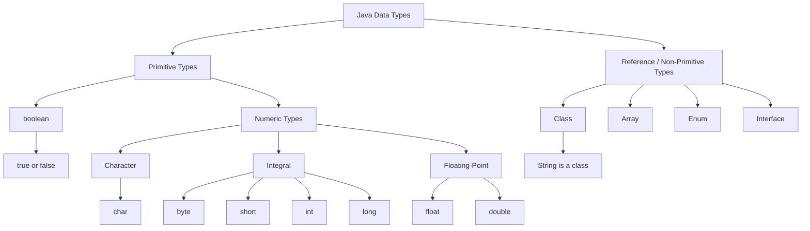

# oracle-certification-java-21

- **Package**  -> A package is an organized module of related interfaces and classes.
- **class** -> A class refers to set of related objects with common properties.
- **Object** -> combination of variables and methods (data structures) 
- **OOP(Object-Oriented-Programming)** ->Revoles with objects and data rather than action and logic. JAVA, PYTHON, KOTLIN uses OOP
- **Method/Function** -> Method is a block of code that can be referenced by name in order to run.
- **Parameter/Arguments** ->Arguments or args is a value that is passed into command or function

## What is Java?
- Java is a programming language released in 1995 by sun micro system which was later acquired by oracle coporation. Java is a platform independent language(WORM). which means write once and ready anywhere.

- When you compile java code it goes into an intermediate language called bytecode. the format of bytecode is independent. 

### Development Tools
  - JDK (Java Development Kit) ->  Includes everything required to build, test and optimize application. It includes 
    - Javac compiler ->  Which turns the code into runnable programms.  Converts Java source code (`.java`) into bytecode (`.class`).
    - Java launcher -> Even fasther with java21 feature
    - Jshell -> Interactive shell for quick testing
    - J package -> which bundles apps into native installers (for distributing) based on operating systems.

 - Java Application Programming Interface
    - Includes core utilities for data structures, file handling and multi threading
 - J package ->jpackage is a JDK tool used to turn a finished Java application into an installer.
 - User Interface toolkits -> For GUI, Swing etc.
 - Integration Libaries -> Dtabase connection etc.

 ### What is JDK, JRE, JVM
 - JDK -> used to develop java applications. include all the tools to develop and run java application.  Inside JDK it has JRE and inside JRE it has JVM and development tools too.
 - JRE ->bundles libaries and the java virtual machine and other components to run application
- JVM -> It runs java programs.

### How this process works?
- Java compiler compiles the code into byte code. 
```diff
javac HelloWorld.java -> compiles the code and generates bytecode: HelloWorld.class

To create bytecode
- javac HelloWorld
+ javac HelloWorld.java

To run compiled bytecode
- java HelloWorld.class
+ java HelloWorld

Java Launcher method (Java 11+)
- java HelloWorld
+ java HelloWorld.java
```
### Package Naming Rules

- By convention, package names start with a lowercase letter.

  ```java
  package com.example.app;
  ```

- A package name cannot contain spaces.
- Numbers can be used after the first letter.
- Capital letters are technically allowed
- Keywords are not allowed

  ```java
  package com.example.java21; // Valid
  ```

- Hyphens and symbols such as `@`, `#`, and `!` cannot be used. Cannot be used anywhere not at start or end

  ```java
  package com.example.my-app; // Invalid
  ```

- Dots (`.`) separate package names.

  ```java
  package com.company.project;
  ```

### Class Naming Rules

- By convention, a class name starts with a capital letter.

  ```java
  class Student { }
  ```

- A class name cannot contain spaces.

  ```diff
  - class Student Details { }
  ```

- Numbers are allowed after the first character.

  ```java
  class Student21 { }
  ```

- A class name cannot start with a number.

  ```diff
  - class 21Student { }
  ```

- Underscore (`_`) and dollar sign (`$`) are allowed as the first character or later characters or even in middle, but normally avoided.

  ```java
  class _Student { }   // Valid, but not recommended
  class $Student { }   // Valid, but not recommended
  class Student_21 { } // Valid, but not recommended
  ```

- Hyphens and symbols such as `@`, `#`, and `!` cannot be used anywhere.

  ```diff
  - class Student-Details { }
  - class Student@Details { }
  ```

- Java keywords cannot be used as class names.

  ```diff
  - class class { }
  ```

- Class names can contain capital letters. By convention, use **PascalCase**.

  ```java
  class StudentDetails { } // Recommended
  ```

### Java Main Method

A Java program starts from the `main` method.

```java
public class HelloWorld {

    public static void main(String[] args) {
        System.out.println("Hello World");
    }
}
```

#### What can change?


- The parameter name can change.

  ```java
  public static void main(String[] names) { }
  ```

- Array brackets can be written in different valid ways.

  ```java
  public static void main(String[] args) { }
  public static void main(String args[]) { }
  ```

- Varargs can be used instead of an array.

  ```java
  public static void main(String... args) { } // Valid
  ```

  ```diff
  - public static void main(String args...) { } // Invalid
  ```

- Modifier order can change, although `public static` is the normal style.

  ```java
  static public void main(String[] args) { }
  ```

#### What cannot change?

- The method name must be `main`.

  ```diff
  - public static void start(String[] args) { }
  ```

- It must be `public` and `static`.

  ```diff
  - static void main(String[] args) { }
  - public void main(String[] args) { }
  ```

- The return type must be `void`.

  ```diff
  - public static int main(String[] args) { }
  ```

- The parameter type must be `String[]` or `String...`.

  ```diff
  - public static void main(int[] args) { }
  - public static void main(String args) { }
  ```

### System.out.print methods
- System.out.print() -> Prints but doesnt keep a new line afterwards
- System.out.println() -> Prints and keep a new line afterwards
- System.out.printf() -> provides string formating 
    - System.out.printf("Hello %s" , "World");. ->  
        - %s → String / any object as text
        - %d → integer numbers (`int`, `long`, etc.)
        - %f → decimal numbers (`float`, `double`)
        - %b → boolean (`true` / `false`)
        - %n → new line

 

### Comments in Java

- A **single-line comment** starts with `//`.

  ```java
  // This is a single-line comment
  int age = 25;
  ```

- A **multi-line comment** starts with `/*` and ends with `*/`.

  ```java
  /*
   This is a multi-line comment.
   It can continue on many lines.
  */
  int age = 25;
  ```

- A **documentation comment** starts with `/**` and ends with `*/`.
  It is used to generate documentation using `javadoc`.

  ```java
  /**
   * Prints a welcome message.
   */
  public void welcome() {
      System.out.println("Welcome");
  }
  ```

### Scanner Class

Import the `Scanner` class:

```java
import java.util.Scanner;
```

Create a `Scanner` object to read keyboard input:

```java
Scanner input = new Scanner(System.in);
```

Read different input types:

```java
System.out.println("Enter a number:");
int number = input.nextInt();        // int

System.out.println("Enter a decimal number:");
double price = input.nextDouble();   // double

System.out.println("Enter a float value:");
float value = input.nextFloat();     // float

System.out.println("Enter a word:");
String word = input.next();          // one word

System.out.println("Enter a full sentence:");
String sentence = input.nextLine();  // full line

System.out.println("Enter a character:");
char letter = input.nextLine().charAt(0); // one character
```

Close the scanner when you no longer need it:

```java
input.close();
```

### Variables in Java

A variable stores a value in memory.

#### Declaration

Declaration means creating a variable with a data type and a name.

```java
int age;
```

#### Initialization

Initialization means giving a value to a variable.

```java
age = 25;
```

#### Declaration and Initialization Together

```java
int age = 25;
```

#### Multiple Variables in One Line

Variables declared in the same statement must have the same data type.

```java
int age1 = 20, age2 = 25, age3 = 30;
```

```diff
- int age = 20, String name = "Kavinda"; // Invalid
```

### Variable Naming Rules

- A variable name can start with a letter, underscore (`_`), or dollar sign (`$`).

  ```java
  int age;
  int _age;
  int $age;
  ```

- Numbers can be used after the first character.

  ```java
  int age21;
  ```

  ```diff
  - int 21age;
  ```

- Underscore (`_`) and dollar sign (`$`) can be used at the beginning, middle, or end.

  ```java
  int _age;
  int a_ge;
  int age_;

  int $age;
  int a$ge;
  int age$;
  ```

- Spaces, hyphens, and symbols such as `@`, `#`, and `!` cannot be used any where.

  ```diff
  - int student age;
  - int student-age;
  - int student@age;
  ```

- Java keywords cannot be used as variable names.

  ```diff
  - int class = 10;
  ```

- By convention, variable names use `camelCase`.

  ```java
  String studentName = "Kavinda";
  ```
### Types of Variables

#### 1. Instance Variable

An instance variable is declared inside a class but outside methods.

Each object gets its own separate copy.

```java
class Student {
    String name; // Instance variable
}
```

```java
Student s1 = new Student();
Student s2 = new Student();

s1.name = "Kavinda";
s2.name = "Nimal";
```

#### 2. Static Variable

A static variable belongs to the class, not to individual objects.

All objects share one same static variable. Static variable cannot be declared inside a method. it should be inside a class

```java
class Student {
    static String school = "ABC College"; // Static variable
}
```

```java
System.out.println(Student.school);
```

```diff
- void test() {
-     static int count = 0; // Invalid
- }
```


#### 3. Local Variable

A local variable is declared inside a method, constructor, or block.

It can be used only inside that area.

```java
class Student {
    void showAge() {
        int age = 25; // Local variable
        System.out.println(age);
    }
}
```

### Java Data Types



### Primitive Data Types

| Data Type | Size | Range / Description | Default Value |
|---|---:|---|---|
| `byte` | 1 byte (8 bits) | -128 to 127 | `0` |
| `short` | 2 bytes (16 bits) | -32,768 to 32,767 | `0` |
| `int` | 4 bytes (32 bits) | -2³¹ to 2³¹ - 1 | `0` |
| `long` | 8 bytes (64 bits) | -2⁶³ to 2⁶³ - 1 | `0L` |
| `float` | 4 bytes (32 bits) | Decimal number; add `f` or `F` at the end | `0.0f` |
| `double` | 8 bytes (64 bits) | Decimal number; default decimal type | `0.0d` |
| `char` | 2 bytes (16 bits) | Stores one Unicode character | `'\u0000'` |
| `boolean` | JVM-dependent | Stores only `true` or `false` | `false` |
| Reference types (`String`, arrays, classes, etc.) | — | Stores an object reference | `null` |


### Numeric Literals

#### `long` Literal

A whole number is treated as an `int` by default. If the number is too large for `int`, add `L` or `l` at the end to make it a `long`.

```diff
- long i = 1234561231311; // Compilation error: number is too large for int
```

```java
long i = 1234561231311L; // Valid
long j = 1234561231311l; // Valid, but uppercase L is recommended
```

#### Underscore (`_`) in Numbers

Underscores can make large numbers easier to read.

```java
int population = 1_000_000; // Valid
double price = 1_250.50_75; // Valid
```

Underscores cannot be at the beginning or end of a number.

```diff
- int number = _1000;  // Invalid
- int number = 1000_;  // Invalid
```

For decimal numbers, an underscore cannot be immediately before or after the decimal point or at the begining or end of the number.

```diff
- double price = 1250_.50; // Invalid
- double price = 1250._50; // Invalid
```

### Number Systems in Java

Java allows integer literals in decimal, binary, octal, and hexadecimal.

#### 1. Decimal (Base 10)

Decimal is the normal number system. It uses digits from `0` to `9`.

```java
int num = 25;
```

```text
25 = (2 × 10) + 5
```

#### 2. Binary (Base 2)

Binary uses only `0` and `1`.

Use `0b` or `0B` before the number.

```java
int num = 0b1101;
```

```text
0b1101 = (1 × 8) + (1 × 4) + (0 × 2) + (1 × 1)
        = 13
```

#### 3. Octal (Base 8)

Octal uses digits from `0` to `7`.

Use `0` before the number.

```java
int num = 014;
```

```text
014 = (1 × 8) + 4
    = 12
```

#### 4. Hexadecimal (Base 16)

Hexadecimal uses digits `0` to `9` and letters `A` to `F`.

Use `0x` or `0X` before the number.

```java
int num = 0x1A;
```

```text
0x1A = (1 × 16) + 10
     = 26
```

```java
int decimal = 13;
int binary = 0b1101; // 13
int octal = 015;     // 13
int hexadecimal = 0xD; // 13
```


